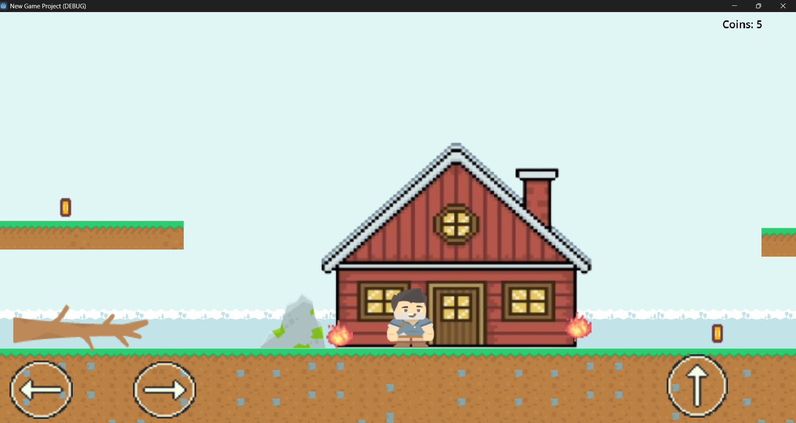
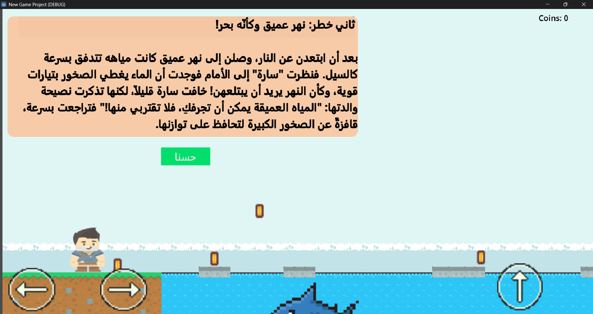
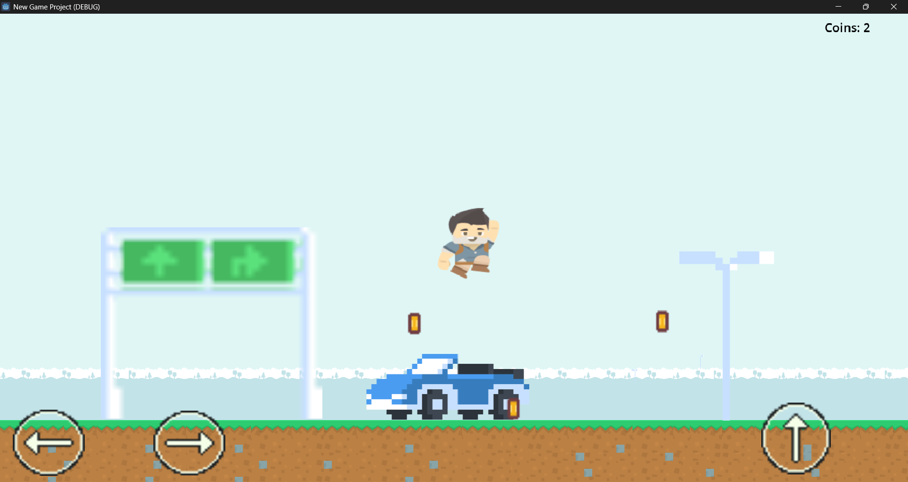
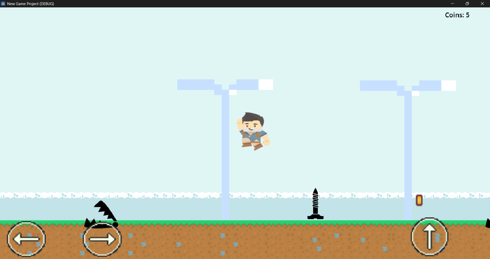
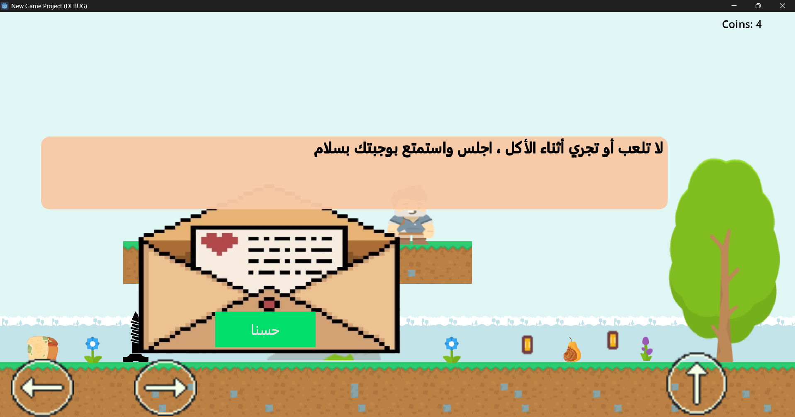
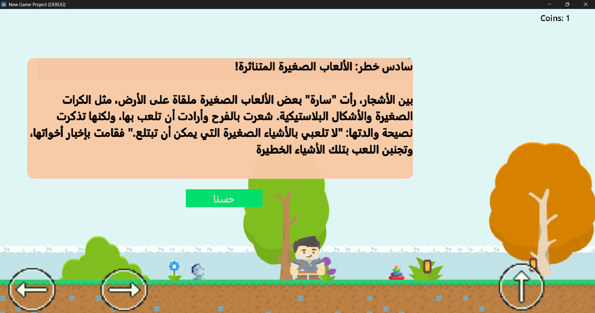

# 🎮 SafeSteps: Learn Safety Through Play  
*A Godot-powered educational game for children*

---

## 🧠 What is SafeSteps?

**SafeSteps** is a 2D educational game developed in the **Godot Engine** to teach children how to recognize and avoid dangerous situations in their everyday environments. Through **6 interactive levels**, a simple storyline, collectible rewards, and child-friendly visuals, the game encourages smart, safe choices — all through fun, exploration, and storytelling.

---

## ✨ Game Features

- 🎯 **6 unique danger-themed levels**
- 🧭 **Coins rewarded for safe movement**
- 💡 **Advice messages unlocked with progress**
- 🔁 **Restart on danger touch — learn through retrying**
- 📖 **Storyline-driven progression**
- 🖼️ **Visual storytelling through in-game scenes**

---

## 🧩 Levels Overview

| Level | Theme               | Description                                  | Preview               |
|-------|---------------------|----------------------------------------------|------------------------|
| 1     | 🔥 Fire              | Avoid flames and smoke hazards               |           |
| 2     | 🌊 Water & Drowning | Stay away from deep water & unsupervised areas |         |
| 3     | 🚗 Cars & Roads      | Learn road safety and avoid moving vehicles  |         |
| 4     | 🪨 Sharp Spikes      | Recognize and avoid harmful objects          |         |
| 5     | 🍕 Spoiled Food      | Identify and reject bad food                 |         |
| 6     | 🧸 Dangerous Toys     | Know the difference between safe and unsafe toys |     |

---

---

## 📸 Visual Snapshots

- **Level 1 – Fire Danger**  
  

- **Level 2 – Water & Drowning** *(with storyteller visible)*  
  

- **Level 3 – Cars & Roads** *(character in action)*  
  

- **Level 4 – Sharp Spikes**  
  

- **Level 5 – Spoiled Food** *(with advice hint visible)*  
  

- **Level 6 – Dangerous Toys**  
  

---
## 🏆 Gameplay Mechanics

- 🪙 **Coin Collection**  
  Players earn coins by moving *away* from hazards, reinforcing smart decisions.

- 💬 **Advice System**  
  Every few coins, players unlock short messages or tips that educate them on safety — building a sense of progress and achievement.

- 🔁 **Hazard Reset**  
  If the character touches a danger, the level resets — gently encouraging the child to try again and make safer choices.

- 📖 **Story Integration**  
  At the beginning of each level, a short story scene helps kids understand the context and importance of the lesson ahead.

---

## 👨‍👩‍👧 Who Is It For?

- **Children aged 4–10**
- Parents who want to introduce safety education at home
- Educators looking for a classroom-friendly interactive tool
- Game developers exploring educational mechanics in Godot

---

## 🛠️ Built With

- [Godot Engine](https://godotengine.org/)
- GDScript for logic and interactions
- 2D sprites and storyboards for narrative-driven gameplay

---

## 🚀 Getting Started

1. Download or clone this repository
2. Open the project in Godot Engine
3. Press `F5` or click ▶️ to run the game

---

## 📬 Feedback & Contributions

Have ideas, feedback, or want to contribute? Feel free to fork the repo or open an issue.  
Let’s make learning safety **fun and memorable** together!

---

> “Safety doesn’t have to be scary — it can be playful, rewarding, and powerful.”
